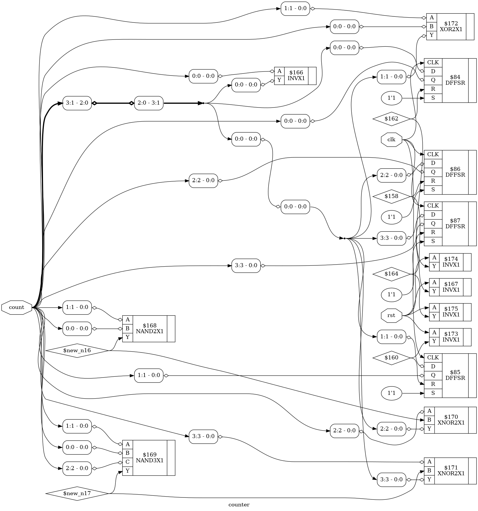

# 29_4bit_counter_synth

## Overview

This project demonstrates the RTL synthesis of a **4-bit Binary Counter** using **Yosys**, an open-source RTL synthesis tool. The Verilog HDL design is synthesized, optimized, and mapped to the **OSU018 Standard Cell Library** to generate a gate-level netlist and synthesized circuit schematic.

This lab is part of the **RTL Design and IP Integration** module of the **RTL-to-GDSII Internship**.

---

## Objective

- Design a 4-bit Binary Counter using Verilog HDL.
- Perform RTL synthesis using Yosys.
- Optimize the RTL design.
- Map the design to the OSU018 Standard Cell Library.
- Generate the synthesized gate-level netlist.
- Visualize the synthesized hardware schematic.
- Understand sequential logic synthesis.

---

## 4-bit Counter

A **4-bit Binary Counter** is a sequential logic circuit that increments its output count on every positive edge of the clock signal. It consists of four flip-flops and can count from **0000 (0)** to **1111 (15)** before rolling over to **0000** again.

The design also includes an **active-high asynchronous reset**, which resets the counter to zero whenever the reset signal is asserted.

---

## Counter Operation

| Reset | Clock Edge | Counter Output |
|:-----:|:----------:|:--------------:|
| 1 | X | 0000 |
| 0 | ↑ | Count + 1 |
| 0 | No Edge | Holds Previous Value |

---

## RTL Logic

```text
If Reset = 1
    Counter = 0000

Else if Rising Edge of Clock
    Counter = Counter + 1
```

---

## Tools Used

| Tool | Purpose |
|------|---------|
| Yosys | RTL Synthesis |
| GVim | Verilog Code Editing |
| Graphviz / xdot | Circuit Visualization |
| OSU018 Standard Cell Library | Technology Mapping |
| Ubuntu Linux | Development Environment |

---

## Project Structure

```text
29_4bit_counter_synth/
├── counter.v
├── counter.ys
├── counter_synth.v
├── counter_schematic.dot
├── counter_schematic.png
└── README.md
```

---

## File Description

| File | Description |
|------|-------------|
| `counter.v` | RTL Verilog implementation of the 4-bit Counter |
| `counter.ys` | Yosys synthesis script |
| `counter_synth.v` | Synthesized gate-level Verilog netlist |
| `counter_schematic.dot` | Graphviz schematic description |
| `counter_schematic.png` | Synthesized hardware schematic |
| `README.md` | Project documentation |

---

## RTL Design

```verilog
module counter(
    input clk,
    input rst,
    output reg [3:0] count
);

always @(posedge clk or posedge rst)
begin
    if (rst)
        count <= 4'b0000;
    else
        count <= count + 1'b1;
end

endmodule
```

---

## Yosys Synthesis Script

```tcl
read_verilog counter.v
hierarchy -check -top counter
proc
opt
memory
opt
techmap
opt
dfflibmap -liberty /home/lab-user/Desktop/bootcamp-files/Tech-pdks/osu018/osu018_stdcells.lib
abc -liberty /home/lab-user/Desktop/bootcamp-files/Tech-pdks/osu018/osu018_stdcells.lib
clean
write_verilog counter_synth.v
show -prefix counter
```

---

## RTL Synthesis Flow

```text
Verilog RTL
      │
      ▼
Read Verilog
      │
      ▼
Hierarchy Check
      │
      ▼
Process Conversion
      │
      ▼
Logic Optimization
      │
      ▼
Technology Mapping
      │
      ▼
Sequential Cell Mapping
      │
      ▼
Gate-Level Netlist Generation
      │
      ▼
Synthesized Hardware Schematic
```

---

## Synthesized Schematic

The synthesized schematic generated by Yosys after mapping the RTL design to the **OSU018 Standard Cell Library**.



---

## Synthesis Results

- RTL design synthesized successfully.
- Sequential logic converted into gate-level implementation.
- Technology mapping completed using the OSU018 Standard Cell Library.
- Gate-level Verilog netlist generated successfully.
- Graphviz schematic generated for visualization.
- Hardware implementation verified after synthesis.

---

## Applications

- Digital Counters
- Frequency Division
- Event Counting
- Timers
- Digital Clocks
- State Machines
- FPGA Design
- ASIC Design
- Embedded Systems

---

## Learning Outcomes

- Verilog HDL for Sequential Logic
- Clocked Circuit Design
- Asynchronous Reset Implementation
- RTL Synthesis using Yosys
- Logic Optimization
- Sequential Cell Mapping
- Technology Mapping
- Gate-Level Netlist Generation
- Hardware Schematic Visualization

---

## Conclusion

The **4-bit Binary Counter** was successfully synthesized using **Yosys**. The RTL description was optimized and mapped to the **OSU018 Standard Cell Library**, resulting in a gate-level implementation of the sequential circuit. The generated synthesized netlist and hardware schematic verify the correct functionality of the counter and demonstrate the complete RTL synthesis workflow for sequential digital circuits.
