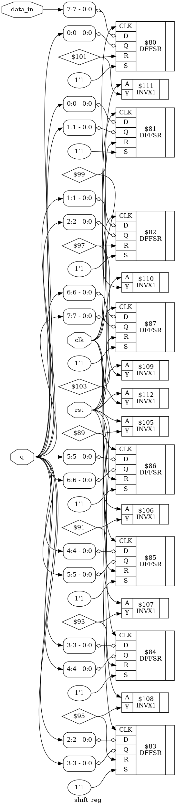

# 30_Shift_Reg_synth

## Overview

This project demonstrates the RTL synthesis of an **8-bit Shift Register** using **Yosys**, an open-source RTL synthesis tool. The Verilog HDL design is synthesized, optimized, and mapped to the **OSU018 Standard Cell Library** to generate a gate-level netlist and synthesized hardware schematic.

This lab is part of the **RTL Design and IP Integration** module of the **RTL-to-GDSII Internship**.

---

## Objective

- Design an 8-bit Shift Register using Verilog HDL.
- Perform RTL synthesis using Yosys.
- Optimize the RTL design.
- Map the design to the OSU018 Standard Cell Library.
- Generate the synthesized gate-level netlist.
- Visualize the synthesized hardware schematic.
- Understand sequential logic implementation using flip-flops.

---

## 8-bit Shift Register

An **8-bit Shift Register** is a sequential digital circuit that stores eight bits of data and shifts the stored bits by one position on every rising edge of the clock. In this design, the most significant bit (`data_in[7]`) is shifted into the register while the remaining bits move one position toward the most significant end.

The register also includes an **active-high asynchronous reset**, which clears all stored bits whenever the reset signal is asserted.

---

## Functional Operation

| Reset | Clock Edge | Register Output |
|:-----:|:----------:|:---------------:|
| 1 | X | 00000000 |
| 0 | ↑ | `{q[6:0], data_in[7]}` |
| 0 | No Edge | Holds Previous Value |

---

## RTL Logic

```text
If Reset = 1
    Q = 00000000

Else on Rising Edge of Clock
    Q = {Q[6:0], Data_in[7]}
```

---

## Tools Used

| Tool | Purpose |
|------|---------|
| Yosys | RTL Synthesis |
| GVim | Verilog Code Editing |
| Graphviz / xdot | Hardware Schematic Visualization |
| OSU018 Standard Cell Library | Technology Mapping |
| Ubuntu Linux | Development Environment |

---

## Project Structure

```text
30_Shift_Reg_synth/
├── shift_reg.v
├── shift_reg.ys
├── shift_reg_synth.v
├── shift_reg_schematic.dot
├── shift_reg_schematic.png
└── README.md
```

---

## File Description

| File | Description |
|------|-------------|
| `shift_reg.v` | RTL Verilog implementation of the 8-bit Shift Register |
| `shift_reg.ys` | Yosys synthesis script |
| `shift_reg_synth.v` | Synthesized gate-level Verilog netlist |
| `shift_reg_schematic.dot` | Graphviz schematic description |
| `shift_reg_schematic.png` | Synthesized hardware schematic |
| `README.md` | Project documentation |

---

## RTL Design

```verilog
module shift_reg(
    input clk,
    input rst,
    input [7:0] data_in,
    output reg [7:0] q
);

always @(posedge clk or posedge rst)
begin
    if(rst)
        q <= 8'b00000000;
    else
        q <= {q[6:0], data_in[7]};
end

endmodule
```

---

## Yosys Synthesis Script

```tcl
read_verilog shift_reg.v
hierarchy -check -top shift_reg
proc
opt
fsm
opt
memory
opt
techmap
opt
dfflibmap -liberty /home/lab-user/Desktop/bootcamp-files/Tech-pdks/osu018/osu018_stdcells.lib
abc -liberty /home/lab-user/Desktop/bootcamp-files/Tech-pdks/osu018/osu018_stdcells.lib
clean
write_verilog shift_reg_synth.v
show -prefix shift_reg
```

---

## RTL Synthesis Flow

```text
Verilog RTL
      │
      ▼
Read Verilog
      │
      ▼
Hierarchy Check
      │
      ▼
Process Conversion
      │
      ▼
Finite State Machine Optimization
      │
      ▼
Memory Optimization
      │
      ▼
Technology Mapping
      │
      ▼
Sequential Cell Mapping
      │
      ▼
Gate-Level Netlist Generation
      │
      ▼
Synthesized Hardware Schematic
```

---

## Synthesized Schematic

The synthesized hardware schematic generated after mapping the RTL design to the **OSU018 Standard Cell Library**.



---

## Synthesis Results

- RTL synthesis completed successfully.
- Sequential register chain synthesized.
- Technology mapping completed using the OSU018 Standard Cell Library.
- Flip-flops mapped into standard sequential cells.
- Gate-level Verilog netlist generated.
- Hardware schematic generated successfully.
- Functional behavior preserved after synthesis.

---

## Applications

- Serial Data Transfer
- Parallel-to-Serial Conversion
- Serial-to-Parallel Conversion
- Digital Delay Elements
- Data Buffering
- Communication Systems
- FPGA Design
- ASIC Design
- Embedded Systems

---

## Learning Outcomes

- Verilog HDL for Sequential Logic
- Register-Based Circuit Design
- Shift Register Implementation
- RTL Synthesis using Yosys
- Sequential Cell Mapping
- Technology Mapping
- Gate-Level Netlist Generation
- Hardware Schematic Visualization

---

## Conclusion

The **8-bit Shift Register** was successfully synthesized using **Yosys**. The RTL design was optimized and mapped to the **OSU018 Standard Cell Library**, producing a gate-level implementation that preserves the intended shifting behavior. The generated synthesized netlist and hardware schematic verify the correctness of the sequential circuit and demonstrate the complete RTL synthesis workflow.
