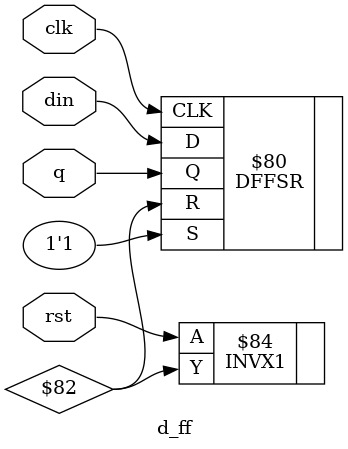

# 31_DFF_synth

## Overview

This project demonstrates the RTL synthesis of a **D Flip-Flop (DFF)** using **Yosys**, an open-source RTL synthesis tool. The Verilog HDL design is synthesized, optimized, and mapped to the **OSU018 Standard Cell Library** to generate a gate-level netlist and synthesized hardware schematic.

This lab is part of the **RTL Design and IP Integration** module of the **RTL-to-GDSII Internship**.

---

## Objective

- Design a D Flip-Flop using Verilog HDL.
- Perform RTL synthesis using Yosys.
- Optimize the RTL design.
- Map the design to the OSU018 Standard Cell Library.
- Generate the synthesized gate-level netlist.
- Visualize the synthesized hardware schematic.
- Understand sequential logic implementation using flip-flops.

---

## D Flip-Flop

A **D Flip-Flop (Data Flip-Flop)** is a sequential logic circuit that stores one bit of data. On every rising edge of the clock, the value present at the data input (**D**) is transferred to the output (**Q**). The design also includes a reset signal that initializes the output to zero.

---

## Functional Operation

| Reset | Clock Edge | Q (Next State) |
|:-----:|:----------:|:--------------:|
| 1 | ↑ | 0 |
| 0 | ↑ | D |
| X | No Edge | Holds Previous Value |

---

## RTL Logic

```text
If Reset = 1
    Q = 0

Else on Rising Edge of Clock
    Q = D
```

---

## Tools Used

| Tool | Purpose |
|------|---------|
| Yosys | RTL Synthesis |
| GVim | Verilog Code Editing |
| Graphviz / xdot | Hardware Schematic Visualization |
| OSU018 Standard Cell Library | Technology Mapping |
| Ubuntu Linux | Development Environment |

---

## Project Structure

```text
31_DFF_synth/
├── d_ff.v
├── d_ff.ys
├── d_ff_synth.v
├── d_ff_schematic.dot
├── d_ff_schematic.png
└── README.md
```

---

## File Description

| File | Description |
|------|-------------|
| `d_ff.v` | RTL Verilog implementation of the D Flip-Flop |
| `d_ff.ys` | Yosys synthesis script |
| `d_ff_synth.v` | Synthesized gate-level Verilog netlist |
| `d_ff_schematic.dot` | Graphviz schematic description |
| `d_ff_schematic.png` | Synthesized hardware schematic |
| `README.md` | Project documentation |

---

## RTL Design

```verilog
module d_ff(
    input clk,
    input rst,
    input din,
    output reg q
);

always @(posedge clk or posedge rst)
begin
    if (rst)
        q <= 1'b0;
    else
        q <= din;
end

endmodule
```

---

## Yosys Synthesis Script

```tcl
read_verilog d_ff.v
hierarchy -check -top d_ff
proc
opt
fsm
opt
memory
opt
techmap
opt
dfflibmap -liberty /home/lab-user/Desktop/bootcamp-files/Tech-pdks/osu018/osu018_stdcells.lib
abc -liberty /home/lab-user/Desktop/bootcamp-files/Tech-pdks/osu018/osu018_stdcells.lib
clean
write_verilog d_ff_synth.v
show -prefix d_ff
```

---

## RTL Synthesis Flow

```text
Verilog RTL
      │
      ▼
Read Verilog
      │
      ▼
Hierarchy Check
      │
      ▼
Process Conversion
      │
      ▼
Finite State Machine Optimization
      │
      ▼
Memory Optimization
      │
      ▼
Technology Mapping
      │
      ▼
Sequential Cell Mapping
      │
      ▼
Gate-Level Netlist Generation
      │
      ▼
Synthesized Hardware Schematic
```

---

## Synthesized Schematic

The synthesized hardware schematic generated after mapping the RTL design to the **OSU018 Standard Cell Library**.



---

## Synthesis Results

- RTL synthesis completed successfully.
- Sequential logic synthesized into flip-flop cells.
- Technology mapping completed using the OSU018 Standard Cell Library.
- Gate-level Verilog netlist generated successfully.
- Hardware schematic generated using Graphviz.
- Functional behavior preserved after synthesis.

---

## Applications

- Registers
- Shift Registers
- Counters
- Pipeline Registers
- Finite State Machines (FSMs)
- Data Synchronization
- FPGA Design
- ASIC Design
- Embedded Systems

---

## Learning Outcomes

- Sequential Logic Design
- D Flip-Flop Operation
- Verilog HDL
- RTL Synthesis using Yosys
- Technology Mapping
- Sequential Cell Mapping
- Gate-Level Netlist Generation
- Hardware Schematic Visualization

---

## Conclusion

The **D Flip-Flop** was successfully synthesized using **Yosys**. The RTL design was optimized and mapped to the **OSU018 Standard Cell Library**, producing a gate-level implementation that preserves the intended storage behavior. The generated synthesized netlist and hardware schematic verify the correctness of the sequential circuit and demonstrate the complete RTL synthesis workflow.
