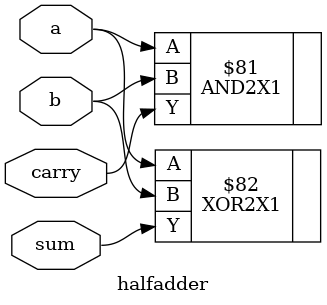

# 33_Halfadder_synth

## Overview

This project demonstrates the **RTL synthesis of a Half Adder** using **Yosys**, an open-source RTL synthesis tool. The Verilog HDL design is synthesized, optimized, and mapped to the **OSU018 Standard Cell Library** to generate a gate-level netlist and synthesized circuit schematic.

This lab is part of the **RTL Design and IP Integration** module of the **RTL-to-GDSII Internship**.

---

## Objective

- Design a Half Adder using Verilog HDL.
- Perform RTL synthesis using Yosys.
- Optimize the RTL design.
- Map the design to the OSU018 Standard Cell Library.
- Generate the synthesized gate-level netlist.
- Visualize the synthesized hardware schematic.
- Analyze the synthesized logic implementation.

---

## Half Adder

A **Half Adder** is a combinational logic circuit that performs the addition of two single-bit binary inputs. It produces two outputs:

- **Sum (S)** – Result of binary addition.
- **Carry (C)** – Carry generated during addition.

### Truth Table

| A | B | Sum | Carry |
|:-:|:-:|:---:|:-----:|
| 0 | 0 |  0  |   0   |
| 0 | 1 |  1  |   0   |
| 1 | 0 |  1  |   0   |
| 1 | 1 |  0  |   1   |

---

## Logic Equations

```text
Sum   = A ⊕ B
Carry = A · B
```

---

## Tools Used

| Tool | Purpose |
|------|---------|
| Yosys | RTL Synthesis |
| GVim | Verilog Code Editing |
| Graphviz / xdot | Schematic Visualization |
| OSU018 Standard Cell Library | Technology Mapping |
| Ubuntu Linux | Development Environment |

---

## Project Structure

```text
33_Halfadder_synth/
├── halfadder.v
├── halfadder.ys
├── halfadder_synth.v
├── halfadder_schematic.dot
├── halfadder_schematic.png
└── README.md
```

---

## File Description

| File | Description |
|------|-------------|
| `halfadder.v` | RTL Verilog implementation of the Half Adder |
| `halfadder.ys` | Yosys synthesis script |
| `halfadder_synth.v` | Synthesized gate-level Verilog netlist |
| `halfadder_schematic.dot` | Graphviz schematic description |
| `halfadder_schematic.png` | Synthesized circuit schematic |
| `README.md` | Project documentation |

---

## RTL Design

```verilog
module halfadder(
    input a,
    input b,
    output sum,
    output carry
);

assign sum = a ^ b;
assign carry = a & b;

endmodule
```

---

## Yosys Synthesis Script

```tcl
read_verilog halfadder.v
hierarchy -check -top halfadder
proc
opt
memory
opt
techmap
opt
abc -liberty /home/lab-user/Desktop/bootcamp-files/Tech-pdks/osu018/osu018_stdcells.lib
clean
write_verilog halfadder_synth.v
show -prefix halfadder
```

---

## RTL Synthesis Flow

```text
Verilog RTL
      │
      ▼
Read Verilog
      │
      ▼
Hierarchy Check
      │
      ▼
RTL Optimization
      │
      ▼
Technology Mapping
      │
      ▼
Standard Cell Mapping
      │
      ▼
Gate-Level Netlist Generation
      │
      ▼
Synthesized Schematic
```

---

## Synthesized Schematic

> After synthesis, the RTL Half Adder is converted into an optimized gate-level implementation using cells from the **OSU018 Standard Cell Library**.



---

## Synthesis Results

- Successfully synthesized using **Yosys**.
- RTL design optimized for hardware implementation.
- Technology mapping completed using the **OSU018 Standard Cell Library**.
- Generated synthesized gate-level Verilog netlist.
- Generated Graphviz-based synthesized schematic.
- Verified the correct functionality of the Half Adder.

---

## Applications

- Binary Arithmetic Circuits
- Arithmetic Logic Units (ALUs)
- Ripple Carry Adders
- Full Adder Design
- FPGA Design
- ASIC Design
- Digital Signal Processing
- Embedded Systems

---

## Learning Outcomes

- Verilog HDL Design
- Combinational Logic Design
- RTL Synthesis Flow
- Logic Optimization
- Technology Mapping
- Standard Cell Mapping
- Gate-Level Netlist Generation
- Hardware Schematic Visualization
- Understanding Digital Arithmetic Circuits

---

## Conclusion

The Half Adder RTL design was successfully synthesized using **Yosys**. The RTL description was optimized and mapped to the **OSU018 Standard Cell Library**, resulting in a gate-level implementation that preserves the required arithmetic functionality. The generated synthesized netlist and hardware schematic verify the correctness of the design and demonstrate the complete RTL synthesis workflow.
