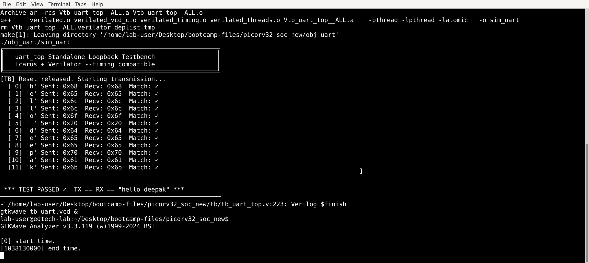
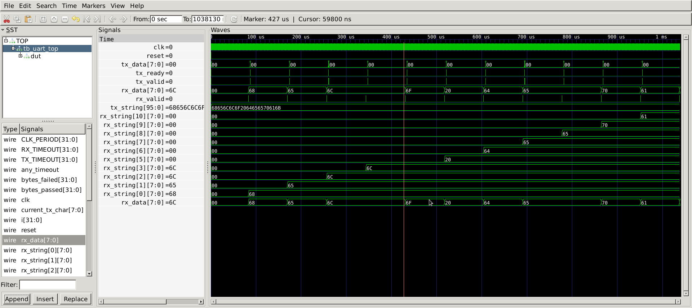

# Lab 3 — UART Protocol

## A Brief Description of UART

**Course:** PicoRV32 SoC Subsystem with AXI-Lite & UART Integration

This lab introduces the UART (Universal Asynchronous Receiver Transmitter) protocol and demonstrates serial communication using an 8N1 frame format. The UART transmitter and receiver are implemented in Verilog RTL and verified using a standalone loopback testbench.

---

## 1. Objective

The objectives of this lab are to:

- Understand the UART communication protocol.
- Understand the 8N1 frame format.
- Understand UART baud rate and clock-cycle calculations.
- Study the UART TX and RX finite state machines.
- Understand mid-bit sampling in the UART receiver.
- Understand the use of a 2-FF synchronizer for asynchronous RX input.
- Simulate UART TX/RX operation using Verilator.
- Verify UART loopback functionality using GTKWave.

---

## 2. UART Protocol

UART is an asynchronous serial communication protocol that uses two main signals:

- **TX** — Transmit data
- **RX** — Receive data

UART does not use a shared clock between transmitter and receiver. Instead, both sides operate using an agreed baud rate.

### 8N1 Frame Format

This lab uses the **8N1** UART format:

```text
Idle | Start | D0 D1 D2 D3 D4 D5 D6 D7 | Stop | Idle
  1      0       Data bits (LSB first)      1      1
```

A complete frame contains:

- 1 start bit
- 8 data bits
- No parity bit
- 1 stop bit

The UART line remains HIGH when idle.

---

## 3. Baud Rate

Baud rate represents the number of transmitted bits per second.

The UART design uses:

```text
Clock Frequency = 50 MHz
Baud Rate       = 115200
```

The number of clock cycles per UART bit is:

```text
CLKS_PER_BIT = CLK_FREQ / BAUD_RATE

CLKS_PER_BIT = 50,000,000 / 115,200
             ≈ 434 cycles
```

Therefore, each UART bit occupies approximately **434 system clock cycles**.

At a 50 MHz clock:

```text
Clock period = 20 ns

Bit period = 434 × 20 ns
           ≈ 8.68 µs
```

---

## 4. UART Transmitter

The UART transmitter implements the following FSM:

```text
IDLE → START → DATA → STOP → IDLE
```

### TX States

| State | Function |
|---|---|
| IDLE | TX remains HIGH and waits for valid data |
| START | Sends the start bit (`0`) |
| DATA | Sends 8 data bits, LSB first |
| STOP | Sends the stop bit (`1`) |

During the DATA state, the shift register shifts the transmitted byte one bit at a time.

---

## 5. UART Receiver

The UART receiver detects the start bit and samples the incoming data near the centre of each bit period.

The RX FSM operates as:

```text
IDLE → START → DATA → STOP → IDLE
```

### RX Operation

1. Wait for RX to fall from HIGH to LOW.
2. Detect the start bit.
3. Wait approximately half a bit period.
4. Confirm the start bit.
5. Sample each data bit at the centre of the bit period.
6. Receive all 8 data bits.
7. Check the stop bit.
8. Assert `data_valid` when the byte is successfully received.

The receiver uses mid-bit sampling to improve tolerance to timing differences between transmitter and receiver.

---

## 6. 2-FF Synchronizer

Since the RX input is asynchronous to the system clock, a two-flip-flop synchronizer is used.

```text
RX
 │
 ▼
┌──────────┐
│ Sync FF1 │
└────┬─────┘
     │
     ▼
┌──────────┐
│ Sync FF2 │
└────┬─────┘
     │
     ▼
 Synchronized RX
```

This reduces the probability of metastability propagating into the UART receiver logic.

---

## 7. Loopback Configuration

The standalone testbench connects the UART transmitter output directly to the receiver input.

```text
        ┌─────────────┐
        │  UART TX    │
        │             │
        │    tx ──────┼────────┐
        └─────────────┘        │
                               │
                               ▼
                         ┌─────────────┐
                         │  UART RX    │
                         │             │
                         │    rx       │
                         └─────────────┘
```

The transmitted data is therefore received by the same UART system.

This allows the testbench to verify:

```text
TX data == RX data
```

---

## 8. RTL Files

### `rtl/uart_tx.v`

UART transmitter implementation.

Responsibilities:

- Generate the UART start bit.
- Transmit 8 data bits.
- Generate the stop bit.
- Control the baud-rate timing.
- Shift data using the TX shift register.

### `rtl/uart_rx.v`

UART receiver implementation.

Responsibilities:

- Synchronize the asynchronous RX input.
- Detect the start bit.
- Perform mid-bit sampling.
- Receive 8 data bits.
- Verify the stop bit.
- Generate `data_valid`.

### `rtl/uart_top.v`

Top-level UART wrapper connecting the transmitter and receiver.

### `tb/tb_uart_top.v`

Standalone UART loopback testbench.

Responsibilities:

- Generate the system clock.
- Apply reset.
- Send test bytes.
- Monitor received data.
- Compare transmitted and received bytes.
- Generate the simulation waveform.

---

## 9. UART Parameters

The design uses:

```verilog
parameter CLK_FREQ  = 50_000_000;
parameter BAUD_RATE = 115_200;
```

Derived timing:

```text
CLKS_PER_BIT = 434
CLKS_HALF_BIT ≈ 217
```

---

## 10. Simulation

The UART standalone simulation is executed using:

```bash
cd ~/Desktop/bootcamp-files/picorv32_soc_new
make uart
```

The simulation:

1. Compiles the UART RTL and testbench.
2. Builds the Verilator simulation.
3. Executes the UART loopback test.
4. Generates `tb_uart.vcd`.
5. Opens GTKWave.

---

## 11. Simulation Result

The UART loopback simulation successfully transmitted and received the test string:

```text
"hello deepak"
```

The terminal output confirmed that every transmitted byte matched the received byte.

Example:

```text
[ 0] 'h' Sent: 0x68 Recv: 0x68 Match: ✓
[ 1] 'e' Sent: 0x65 Recv: 0x65 Match: ✓
[ 2] 'l' Sent: 0x6c Recv: 0x6c Match: ✓
[ 3] 'l' Sent: 0x6c Recv: 0x6c Match: ✓
[ 4] 'o' Sent: 0x6f Recv: 0x6f Match: ✓
...
```

Final verification:

```text
*** TEST PASSED ✓ TX == RX == "hello deepak" ***
```

Therefore, the UART loopback test was successfully verified.

---

## 12. Waveform Verification

The UART waveform was inspected using GTKWave.

Important signals observed:

```text
clk
reset
uart_top.tx
uart_top.rx
uart_tx.state
uart_tx.bit_cnt
uart_rx.state
uart_rx.bit_cnt
uart_rx.data_out
uart_rx.data_valid
```

### TX Waveform

The TX signal follows the expected UART sequence:

```text
IDLE → START → DATA → STOP → IDLE
```

The serial line starts HIGH, transitions LOW for the start bit, transmits the 8 data bits LSB first, and returns HIGH for the stop bit.

### RX Waveform

The RX logic:

```text
IDLE → START → DATA → STOP → IDLE
```

The received byte appears on `data_out`, and `data_valid` pulses when the complete byte has been received successfully.

---

## 13. Timing Verification

For a 50 MHz clock and 115200 baud:

```text
CLKS_PER_BIT = 434 cycles

Bit period ≈ 8.68 µs

Frame length = 10 bits

Frame time = 10 × 8.68 µs
           ≈ 86.8 µs
```

The complete UART frame therefore consists of:

```text
1 Start + 8 Data + 1 Stop = 10 bits
```

---

## 14. Results

The following results were obtained:

| Test | Result |
|---|---|
| UART TX operation | PASS |
| UART RX operation | PASS |
| 8N1 frame format | Verified |
| Baud rate timing | Verified |
| TX → RX loopback | PASS |
| Data integrity | PASS |
| `"hello deepak"` transmission | PASS |

---

## 15. Result Files

The simulation and waveform screenshots are stored in the `results` directory.

```text
results/
├── Simulation_Result.png
└── waveform.png
```

### Simulation Result



### UART Waveform



---

## 16. Common Issues

### `data_valid` never asserts

Check that the UART TX output is correctly connected to the RX input.

### Received data is incorrect

Check:

- Baud rate configuration.
- Clock frequency.
- Mid-bit sampling.
- TX/RX connection.
- RX synchronizer.

### First bit is corrupted

Check that the RX synchronizer registers are correctly reset to the UART idle state.

### GTKWave shows flat signals

Make sure the correct VCD file is opened:

```bash
gtkwave tb_uart.vcd &
```

---

## 17. Key Takeaways

- UART is an asynchronous serial communication protocol.
- UART does not require a shared clock between transmitter and receiver.
- This design uses the 8N1 frame format.
- Data is transmitted LSB first.
- Baud rate determines the bit transmission speed.
- At 50 MHz and 115200 baud, one bit requires approximately 434 clock cycles.
- The TX FSM generates the serial frame.
- The RX FSM detects and samples the serial frame.
- Mid-bit sampling improves receiver reliability.
- A 2-FF synchronizer protects the receiver from metastability caused by the asynchronous RX input.
- Loopback simulation confirmed that transmitted data was correctly received.

---

## 18. Conclusion

The UART standalone design was successfully simulated and verified using Verilator and GTKWave.

The loopback test confirmed:

```text
TX data == RX data
```

The complete test string `"hello deepak"` was transmitted and received without errors, demonstrating correct UART TX/RX operation, 8N1 framing, baud-rate timing, and receiver sampling.

This lab provides the UART communication foundation used in the subsequent PicoRV32 SoC integration labs.
